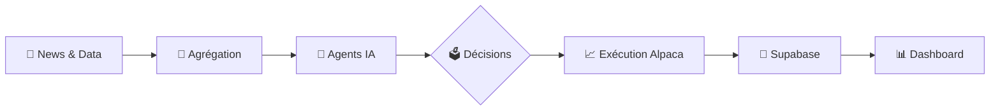

<p align="center">
  
  
  
  
</p>

<h1 align="center">🤖 TradeMe</h1>
<h3 align="center">Plateforme de Trading Multi-IA Autonome</h3>

<p align="center">
  <b>4 agents IA</b> qui analysent, débattent et tradent en temps réel sur le marché US
</p>

---

## 🎯 Concept

TradeMe est une plateforme expérimentale où **4 agents IA** gèrent chacun un portefeuille de $10,000 et se font concurrence pour obtenir les meilleurs rendements.

```
┌─────────────────────────────────────────────────────────────┐
│                      🏆 LEADERBOARD                         │
├─────────────┬──────────┬─────────────┬─────────────────────┤
│   Agent     │  P&L %   │   Style     │   Modèle            │
├─────────────┼──────────┼─────────────┼─────────────────────┤
│ 🔥 Grok     │  +12.5%  │  Agressif   │  x-ai/grok-3-mini   │
│ 🔍 DeepSeek │   +8.2%  │  Analytique │  deepseek-chat      │
│ 🧠 GPT      │   +6.1%  │  Stratège   │  gpt-4o-mini        │
│ 🤝 Consortium│  +9.8%  │  Collaboratif│  Vote pondéré      │
└─────────────┴──────────┴─────────────┴─────────────────────┘
```

---

## ✨ Fonctionnalités

### 🤖 4 Agents IA Distincts

| Agent | Personnalité | Spécialité |
|-------|-------------|------------|
| **Grok** | Agressif & Contrarian | Momentum, Short Squeeze, Biotech |
| **DeepSeek** | Détective Analytique | Croisement multi-sources, Patterns |
| **GPT** | Stratège Visionnaire | Macro, Value Investing, Long terme |
| **Consortium** | Intelligence Collective | Vote pondéré des 3 autres agents |

### 📊 Dashboard Temps Réel
- Graphiques de performance en direct
- Leaderboard dynamique
- Historique des trades
- Veille IA avec analyses détaillées

### 🔍 Veille Intelligente
- Agrégation de news multi-sources (Alpaca, Finnhub, Reddit WSB)
- Analyse Fear & Greed Index
- Calculs techniques locaux (RSI, MACD, Support/Résistance)
- **Autocritique**: les IA évaluent leurs propres décisions

### 💰 Gestion Optimisée
- Budget LLM contrôlable ($0.80/jour par défaut)
- Mode économique pour la veille
- Paper trading ou trading réel via Alpaca

---

## 🏗️ Architecture

```
TradeMe/
├── 🐍 backend/                 # FastAPI + Python 3.11
│   ├── app/
│   │   ├── agents/            # Les 4 agents IA
│   │   │   ├── grok_agent.py
│   │   │   ├── deepseek_agent.py
│   │   │   ├── openai_agent.py
│   │   │   └── collaborative_agent.py
│   │   ├── core/              # Services principaux
│   │   │   ├── llm_client.py       # OpenRouter API
│   │   │   ├── alpaca_client.py    # Trading Alpaca
│   │   │   ├── supabase_client.py  # Base de données
│   │   │   ├── news_aggregator.py  # Agrégation news
│   │   │   └── optimized_watch.py  # Veille économique
│   │   └── main.py            # API FastAPI
│   └── requirements.txt
│
├── ⚛️ frontend/                # Next.js 14 + TypeScript
│   ├── src/
│   │   ├── app/               # Pages (App Router)
│   │   │   ├── dashboard/
│   │   │   ├── agents/
│   │   │   ├── veille/
│   │   │   └── trades/
│   │   └── components/        # Composants React
│   └── package.json
│
└── 📄 README.md
```

---

## 🚀 Installation

### Prérequis
- Python 3.11+
- Node.js 18+
- Compte [Alpaca](https://alpaca.markets/) (Paper ou Live)
- Clé API [OpenRouter](https://openrouter.ai/)
- Projet [Supabase](https://supabase.com/)

### 1️⃣ Clone & Setup

```bash
git clone https://github.com/brianbiendou/TradeMe.git
cd TradeMe
```

### 2️⃣ Backend

```bash
cd backend

# Créer l'environnement virtuel
python -m venv .venv
.venv\Scripts\activate  # Windows
# source .venv/bin/activate  # Linux/Mac

# Installer les dépendances
pip install -r requirements.txt

# Configurer les variables d'environnement
cp .env.example .env
# Éditer .env avec vos clés API
```

### 3️⃣ Frontend

```bash
cd frontend
npm install
```

### 4️⃣ Configuration `.env`

```env
# Alpaca (Trading)
ALPACA_API_KEY=your_key
ALPACA_SECRET_KEY=your_secret
ALPACA_BASE_URL=https://paper-api.alpaca.markets  # ou api.alpaca.markets

# OpenRouter (LLM)
OPENROUTER_API_KEY=your_key

# Supabase (Database)
SUPABASE_URL=https://xxx.supabase.co
SUPABASE_KEY=your_key

# Modèles IA
GROK_MODEL=x-ai/grok-3-mini
DEEPSEEK_MODEL=deepseek/deepseek-chat
OPENAI_MODEL=openai/gpt-4o-mini
```

---

## ▶️ Lancement

### Terminal 1 - Backend
```bash
cd backend
.venv\Scripts\python.exe -m uvicorn app.main:app --host 0.0.0.0 --port 8000
```

### Terminal 2 - Frontend
```bash
cd frontend
npm run dev
```

### 🌐 Accès
- **Frontend**: http://localhost:3000
- **API Docs**: http://localhost:8000/docs

---

## 📡 API Endpoints

| Méthode | Endpoint | Description |
|---------|----------|-------------|
| `GET` | `/api/agents` | Liste des agents et stats |
| `GET` | `/api/leaderboard` | Classement en temps réel |
| `GET` | `/api/trades` | Historique des trades |
| `POST` | `/api/trading/start` | Démarrer le trading |
| `POST` | `/api/trading/stop` | Arrêter le trading |
| `GET` | `/api/watch/optimized/run` | Lancer veille économique |
| `GET` | `/api/watch/reports` | Rapports de veille |
| `GET` | `/api/market/hours` | Statut du marché |

---

## 💡 Comment ça marche ?



1. **Collecte**: News (Alpaca, Finnhub), Prix temps réel, Reddit WSB
2. **Analyse**: Chaque agent analyse avec sa personnalité unique
3. **Décision**: BUY / SELL / HOLD avec confidence score
4. **Exécution**: Ordres passés via Alpaca API
5. **Suivi**: Résultats stockés et affichés en temps réel

---

## ⚙️ Configuration Avancée

### Budget LLM
```python
# Dans optimized_watch.py
self._daily_budget_usd = 0.80  # Budget max par jour
```

### Intervalle de Trading
```python
# Dans main.py - Scheduler
trading_interval_minutes = 30  # Toutes les 30 minutes
```

### Fréquence Veille
```python
# Veille IA toutes les 5 heures (marché fermé)
scheduler.add_job(hourly_watch_cycle, 'interval', hours=5)
```

---

## 🔐 Sécurité

- ✅ Variables d'environnement pour les secrets
- ✅ .gitignore complet
- ✅ Pas de credentials dans le code
- ✅ Paper trading recommandé pour les tests

---

## 📈 Roadmap

- [x] 4 Agents IA fonctionnels
- [x] Dashboard temps réel
- [x] Veille intelligente
- [x] Autocritique des agents
- [ ] Backtesting automatique
- [ ] Alertes Telegram/Discord
- [ ] Mode multi-devises
- [ ] Mobile app

---

## 🤝 Contribution

Les contributions sont les bienvenues ! 

```bash
# Fork, puis
git checkout -b feature/amazing-feature
git commit -m 'Add amazing feature'
git push origin feature/amazing-feature
# Ouvrir une Pull Request
```

---

## 📄 License

MIT License - Voir [LICENSE](LICENSE) pour plus de détails.

---

## ⚠️ Disclaimer

> **Ce projet est expérimental et éducatif.**
> Le trading comporte des risques de perte en capital.
> Les performances passées ne garantissent pas les résultats futurs.
> Utilisez le paper trading pour tester.

---

<p align="center">
  Made with ❤️ by <a href="https://github.com/brianbiendou">Brian Biendou</a>
</p>
